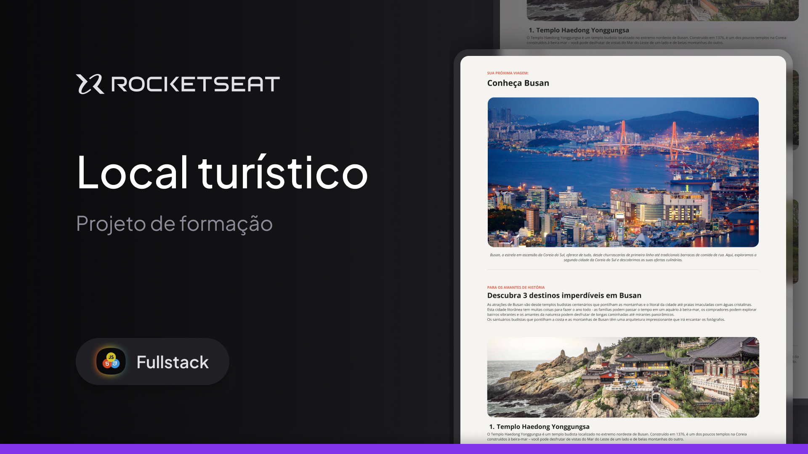

<h1 align="center">DevLinks</h1>

  Programa exclusivo, promovido pela Rocketseat para ensino de tecnologias WEB.

  <a href="#-tecnologias">Tecnologias</a>&nbsp;&nbsp;&nbsp;|&nbsp;&nbsp;&nbsp;
  <a href="#-projeto">Projeto</a>&nbsp;&nbsp;&nbsp;|&nbsp;&nbsp;&nbsp;
  <a href="#-layout">Layout</a>&nbsp;&nbsp;&nbsp;|&nbsp;&nbsp;&nbsp;
  <a href="#memo-licença">Licença</a>

  

 

## 🚀 Tecnologias

Esse projeto foi desenvolvido com as seguintes tecnologias:

- HTML e CSS   
- Git e Github  
- Figma  

## 💻 Projeto

A "página de turismo" é um projeto inicial para testar minhas habilidades adquiridas ao longo de 1 semana.

## 🎨 Layout

Você pode visualizar o layout do projeto através [DESSE LINK](https://www.figma.com/design/2moWw9HqUHgcYjsw1JIRpx/Local-Tur%C3%ADstico--Community-?node-id=915-685&t=vgynsd9RKf74HFu8-1).  
É necessário ter conta no [Figma](https://figma.com) para acessá-lo.

## :memo: Licença

Esse projeto está sob a licença MIT.

---

Feito com ♥ by Ares
